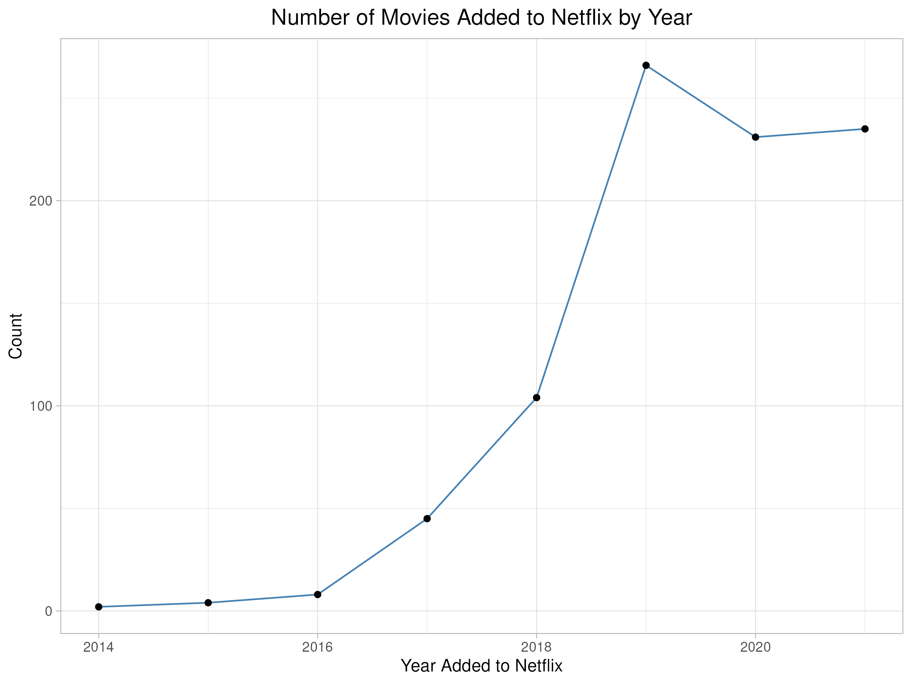
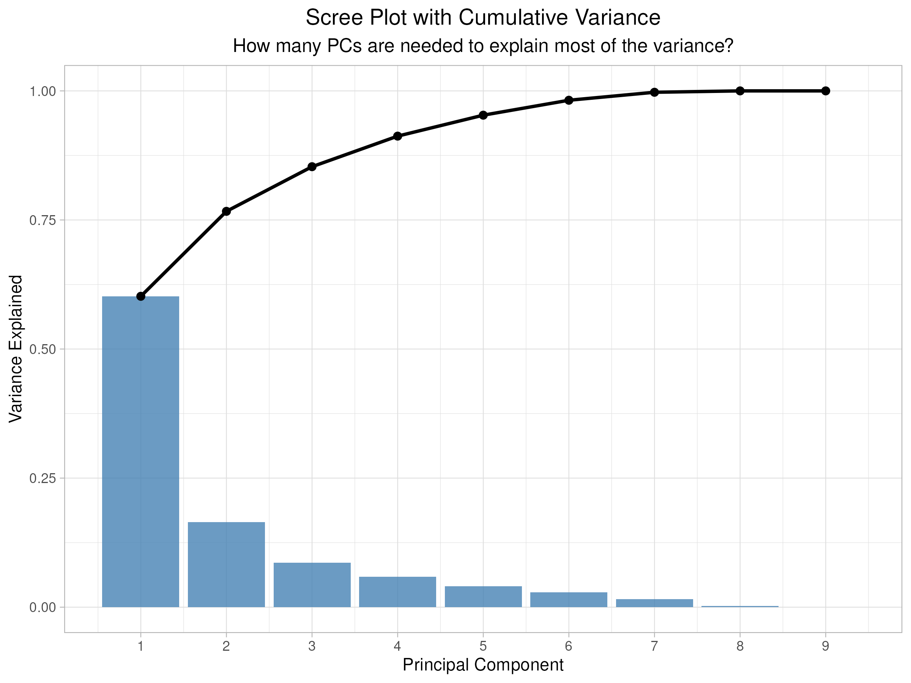

## Exploring the Data

These exploratory data visualizations summarize patterns in the movie dataset. These charts are intended to provide an introduction to the data and begin generating questions about the relationships between variables. Each chart includes a descriptive title and axis labels for orientation to the chart.

\newpage

## Principal Component Analysis

These visualizations explore the PCA performed on numeric features of the movie dataset. This section visualizes the variance explained, as well as analyzes how movie attributes including budget, IMDb votes, and revenue vary across clusters.

\newpage

## Logistic Regression and ROC Curve

A logistic regression model was created to predict whether a movie is critically successful (IMDb rating greater than or equal to 7) based on financial and popularity metrics, and the following chart visualizes the model’s performance using an ROC curve and AUC. An AUC (Area Under the Curve) of 0.81 indicates that the model has good discriminative ability.

